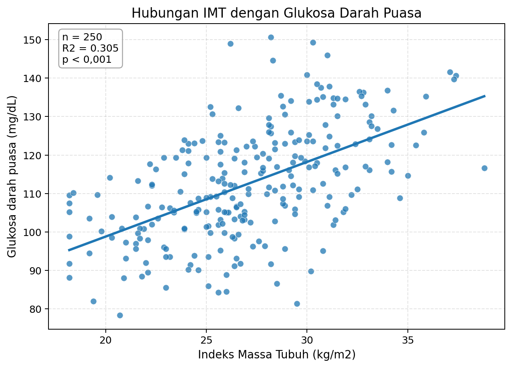
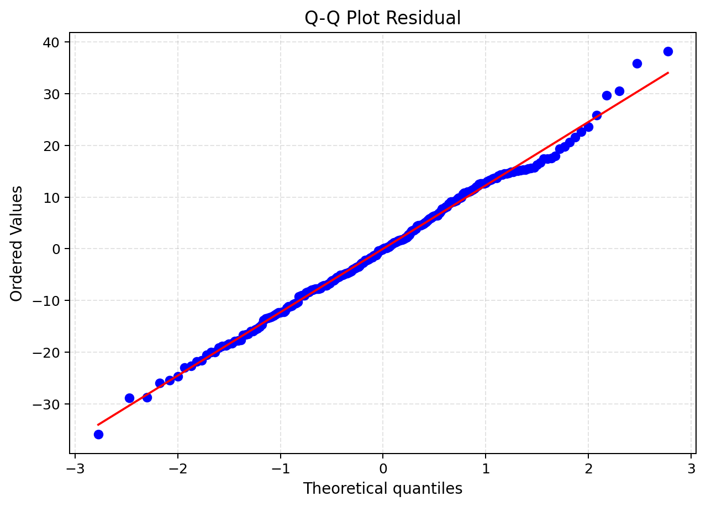
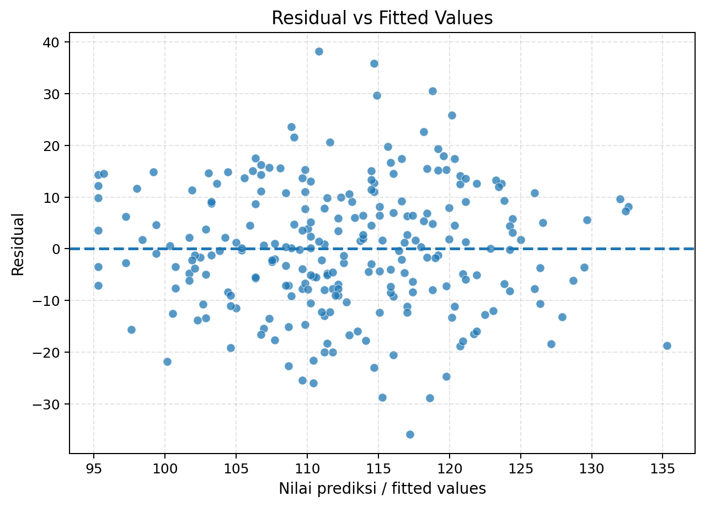

# BMI and Fasting Blood Glucose: Simple Linear Regression


A reproducible R project examining the relationship between **body mass index (BMI)** and **fasting blood glucose (FBG)** using simple linear regression on a synthetic adult health dataset.

**Author:** Mohammad Maliki Rafli  
**Program:** Master of Public Health, Universitas Airlangga

## Table of Contents

- [Project Overview](#project-overview)
- [Project Presentation](#project-presentation)
- [Research Question](#research-question)
- [Repository Structure](#repository-structure)
- [Dataset](#dataset)
- [Analytical Workflow](#analytical-workflow)
- [Model Specification](#model-specification)
- [Key Results](#key-results)
- [Selected Visualizations](#selected-visualizations)
- [Reproducing the Analysis](#reproducing-the-analysis)
- [Interpretation](#interpretation)
- [Limitations](#limitations)
- [Conclusion](#conclusion)
- [License](#license)

## Project Overview

BMI is a practical anthropometric indicator commonly used in public-health assessment, while fasting blood glucose reflects glucose metabolism. This project demonstrates how simple linear regression can quantify their statistical relationship and how residual diagnostics can be used to assess basic model assumptions.

The dataset contains **250 fully synthetic observations** created for programming and statistical-learning purposes. It does not contain real patient or participant data and must not be used for clinical diagnosis.

## Project Presentation

- [View the presentation as PDF](05_Presentation/BMI_Fasting_Glucose_Regression_Analysis.pdf)
- [Read the complete analytical report](01_Laporan/BMI_Fasting_Glucose_Regression_Report.pdf)

## Research Question

Is body mass index significantly associated with fasting blood glucose in the synthetic adult dataset?

## Repository Structure

```text
.
├── 01_Laporan/
│   └── BMI_Fasting_Glucose_Regression_Report.pdf
├── 02_Script/
│   └── BMI_Fasting_Glucose_Simple_Linear_Regression.R
├── 03_Data/
│   └── bmi_fasting_glucose_synthetic_data.csv
├── 04_Output/
│   ├── 01_bmi_fasting_glucose_scatter_plot.png
│   ├── 02_residual_histogram.png
│   ├── 03_residual_qq_plot.png
│   └── 04_residual_vs_fitted.png
├── 05_Presentation/
│   └── BMI_Fasting_Glucose_Regression_Analysis.pdf
├── .gitignore
└── README.md
```

## Dataset

The synthetic dataset includes nine variables:

| Variable | Description | Type | Role in main model |
|---|---|---|---|
| `id` | Observation identifier | Integer | Descriptive |
| `usia_tahun` | Age in years | Integer | Descriptive |
| `jenis_kelamin` | Sex | Categorical | Descriptive |
| `riwayat_keluarga_diabetes` | Family history of diabetes | Categorical | Descriptive |
| `aktivitas_fisik_menit_minggu` | Weekly physical activity | Integer | Descriptive |
| `imt_kg_m2` | Body mass index | Continuous | Independent variable |
| `kelompok_imt` | BMI category | Categorical | Descriptive |
| `glukosa_puasa_mg_dl` | Fasting blood glucose | Continuous | Dependent variable |
| `kategori_glukosa` | Descriptive glucose category | Categorical | Descriptive |

The glucose categories are educational labels derived from simulated values, not clinical diagnoses.

## Analytical Workflow

1. Create and format the synthetic dataset.
2. Inspect dimensions, structure, and variable distributions.
3. Summarize the main numerical and categorical variables.
4. Visualize BMI and fasting blood glucose with a scatter plot.
5. Fit a simple linear regression model using base R.
6. Estimate coefficients, confidence intervals, model fit, and Pearson correlation.
7. Examine residual normality and variance patterns using graphical diagnostics and the Shapiro-Wilk test.
8. Export the reproducible dataset and figures.

## Model Specification

The primary model is:

$$
\text{FBG}_i = \beta_0 + \beta_1\text{BMI}_i + \varepsilon_i
$$

where fasting blood glucose is measured in mg/dL and BMI is measured in kg/m².

## Key Results

| Measure | Estimate |
|---|---:|
| Number of observations | 250 |
| Mean BMI | 27.10 kg/m² |
| Mean fasting blood glucose | 112.58 mg/dL |
| Intercept | 59.992 |
| BMI slope | 1.941 mg/dL per 1 kg/m² |
| 95% CI for BMI slope | 1.574 to 2.307 |
| p-value for BMI slope | < 0.001 |
| Pearson correlation | 0.552 |
| R² | 0.305 |
| Adjusted R² | 0.302 |
| RMSE | 12.177 mg/dL |
| Shapiro-Wilk p-value for residuals | 0.763 |

The fitted equation is:

$$
\widehat{\text{FBG}} = 59.992 + 1.941 \times \text{BMI}
$$

## Selected Visualizations

### BMI and fasting blood glucose



### Residual Q-Q plot



### Residuals versus fitted values



## Reproducing the Analysis

The analysis uses only base R and requires no additional packages.

1. Clone the repository:

   ```bash
   git clone https://github.com/mohmalikirafli/bmi-fasting-glucose-simple-linear-regression.git
   cd bmi-fasting-glucose-simple-linear-regression
   ```

2. Run the script from the repository root:

   ```bash
   Rscript 02_Script/BMI_Fasting_Glucose_Simple_Linear_Regression.R
   ```

The script recreates the dataset in `03_Data/` and regenerates all figures in `04_Output/`.

## Interpretation

Within this synthetic dataset, a 1 kg/m² increase in BMI is associated with an estimated **1.941 mg/dL increase** in mean fasting blood glucose. The association is statistically significant, and BMI alone explains approximately **30.5%** of the observed variation in fasting blood glucose.

The residual diagnostics do not show a strong departure from normality. However, statistical significance in simulated data should be interpreted as a demonstration of the method rather than evidence about a real population.

## Limitations

- The observations are synthetic and do not represent real patients or survey respondents.
- Simple linear regression does not adjust for age, sex, physical activity, family history, diet, medication, or other potential confounders.
- The model estimates an association and does not establish causality.
- The intercept corresponds to BMI = 0, which is outside the clinically meaningful range and should not receive a substantive interpretation.
- The results are intended for academic demonstration and are not suitable for clinical prediction or decision-making.

## Conclusion

The project demonstrates a positive and statistically significant relationship between BMI and fasting blood glucose in a synthetic adult dataset. It provides a compact, reproducible example of simple linear regression, model interpretation, and residual diagnostics using R.

## License

This repository uses dual licensing:

- Source code is released under the [MIT License](LICENSE).
- Original non-code content—including the README, analytical report,
  presentation, figures, and synthetic dataset—is released under the
  [Creative Commons Attribution 4.0 International License](LICENSE-CONTENT.md).

Institutional names and logos, trademarks, and cited or reproduced third-party
materials remain the property of their respective owners and are not
relicensed by this repository.

---

This repository is intended for academic and portfolio purposes in biostatistics and health data science.
